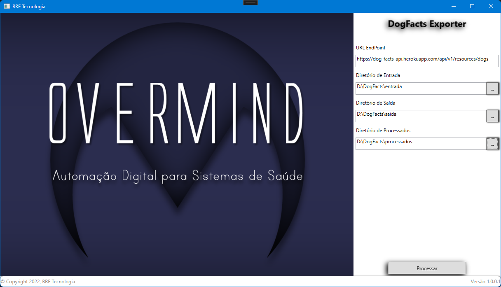

# Overmind - DogFacts Download

Este aplicativo tem por objetivo desmonstrar o uso da API DOGFacts https://dukengn.github.io/Dog-facts-API/

Especificamente o recurso https://dog-facts-api.herokuapp.com/api/v1/resources/dogs?number=# onde é possível passar um valor inteiro de dogfacts a serem recuperados através da API. 

 

# OBJETIVO

A prova consiste em construir um simples barramento em C#, responsável por captar DOG FACTS via API.

O barramento precisará consultar uma planilha que terá na Coluna A diferentes números, cada um em uma linha, como o exemplo enviado em anexo.

Para cada linha, o barramento deverá invocar a API DOG FACTS

https://dog-facts-api.herokuapp.com/api/v1/resources/dogs?number=#

trocando # pelo número informado na célula da coluna A.

 

Os fatos obtidos deverão ser armazenados em uma planilha de output com separação por Aba, ou seja:

Todos os fatos obtidos pela primeira linha da planilha de input deverão ser armazenados, linha a linha, na Aba 1 da planilha de output.

Todos os fatos pela segunda linha da planilha de input deverão ser armazenados, linha a linha, na Aba 2 da planilha de output, e assim sucessivamente.

*É importante atentar que somente os fatos deverão ser escritos na planilha de output: O formato Json não será aceito.

 

O  Barramento deverá apresentar uma simples UI que permita configurar:

a) o endpoint do serviço;

b) o diretório de onde será consumida a planilha de input;

b) o diretório onde será salva a planilha de output.

 

# O REPOSITÓRIO

Este repositório no GitHub foi criado para alocação de projetos diversos, podendo ter seu conteúdo alterado a qualquer tempo.

 

## REQUISITOS E TECNOLOGIAS

.Net Core 6.0+

Visual Studio 2022+

WPF Application .NetCore

MVVM - https://docs.microsoft.com/pt-br/archive/msdn-magazine/2009/february/patterns-wpf-apps-with-the-model-view-viewmodel-design-pattern

NPOI - https://github.com/dotnetcore/NPOI 

 

## DOWNLOAD

O download da aplicação compilada pode ser realizada através da URL: https://github.com/b1rf/overmind-dogfacts/publish/index.html 

Sua instalação é realiazada através do ClickOnce, mais detalhes em: https://docs.microsoft.com/pt-br/visualstudio/deployment/clickonce-security-and-deployment?view=vs-2022

**[DOWNLOAD PACOTE DE INSTALAÇÃO DOGFacts](https://github.com/b1rf/overmind-dogfacts/publish/index.html)** 

 

## INSTRUÇÕES DE USO

1 - Informar URL de serviço do DogFacts

 

2 - Informar Diretório de entrada

*O sistema irá procurar arquivos ".xlsx" no diretório de entrada e irá processar todos os arquivos encontrados contidos na pasta raiz.

 

2 - Informar Diretório de Saída

*O sistema irá salvar os arquivos ".xlsx" gerados no diretório de saída com o mesmo nome do arquivo de entrada.

 

3 - Informar Diretório de Processados

*O sistema irá mover arquivos processados para o diretório este diretório.

 

4 - Validação

*O sistema irá validar os parametros informados e irá habilitar o botão processar, somente se todas as informações forem validadas corretamente.

 

 

 

## CONTRIBUIÇÃO

Existem diversas formas de colaborar neste projeto:

* Enviar registros de erros ou solicitação de melhorias ([E-mail](b1rf@outlook.com.br))
* Revisar a documentação do projeto e enviar qualquer tipo de contribuição via [Pull Request]
* Ajudar na correção de erros ou melhoria da base de código. Para isto, faça um fork do projeto no GitHub e posteriormente nos envie um [Pull Request]

 

## SUPORTE

Em caso de dúvidas ou problemas durante o procedimento de utilização ou execução do código, favor entrar em contato pelos canais de atendimento disponibilizados abaixo.

Para mais informações, contate-me pelo e-mail:
- [E-mail](b1rf@outlook.com.br) - Overmind DogFacts Download

 

## LICENÇA

Este projeto é totalmente aberto, use sem restrições.